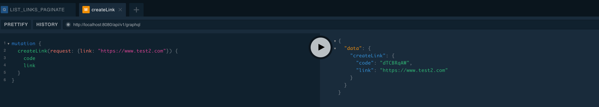

# short-link
link sorter and redirect short code 

## swagger
https://test-sort.herokuapp.com/swagger-ui/index.html

## usage
1. create link \
    [POST] https://test-sort.herokuapp.com/api/v1/link
2. check code - link mapping \
    [GET] https://test-sort.herokuapp.com/api/v1/link/{code}/show
3. use code and redirect \
    [GET] https://test-sort.herokuapp.com/l/{code} \
    example : https://test-sort.herokuapp.com/l/H4PzVEoz

## graph capability

graphql client: https://test-sort.herokuapp.com/playground \
graphql api endpoint : https://test-sort.herokuapp.com/api/v1/graphql

examples:

